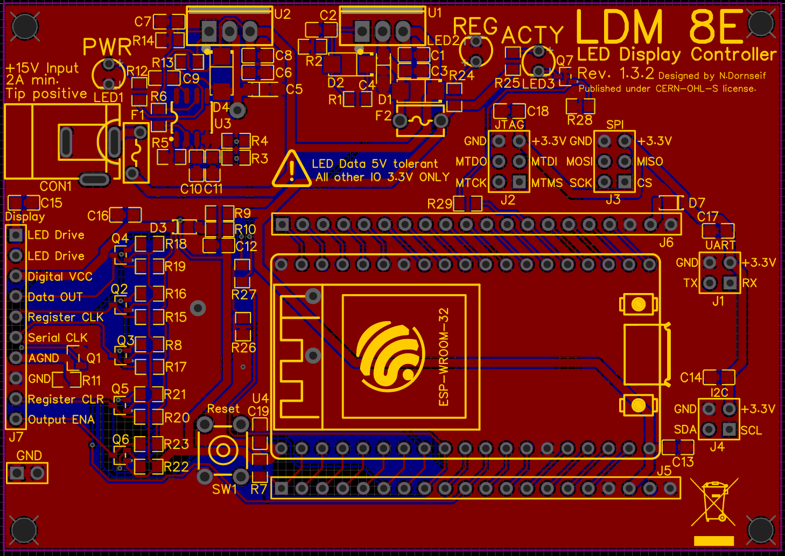

# LDM8E-LED Display Controller
Controller to drive LDM1 or LDM2 modules. 

## Overview
The LDM8E is designed to drive a string of up to four LDM1 or LDM2 display modules.  
It allows individual segment addressing and whole display dimming.  
**Do not mix different display module types.**

## Board overview

## Dimming
The controller supports three different dimming modes.  
Analog dimming, achieved by changing the LED driving voltage,  
Split ground PWM using a separate LED ground and  
Chip Enable PWM using the shift register enable pins.  
Different modes need different components populated.

### Analog dimming
When analog dimming, the output voltage of the driving voltage regulator (U2) is adjusted by
Omitting the feedback network and driving the regulator adjust pin from MCU DAC1 through an op amp (U3).  
Adding R11 connects the LED ground to supply ground and turns them on constantly, allowing Analog dimming.  
Populate: R3, R4, R5, R6, R11, C10, C11, U3  
Omit: Q1, R13, R14, R26, R27  

### PWM dimming  
Including the feedback network R13, R14 fixes the driving voltage regulator (U2) output voltage to 12.7V.  
The brightness is then controlled using PWM by switching the LEDs on and off rapidly. 

#### Split ground PWM dimming  
LDM1 modules use a separate LED ground that is switched using Q1 to achieve dimming.  
Populate: Q1, R13, R14, R26, R27  
Omit: R3, R4, R5, R6, R11, C10, C11, U3  

#### Chip enable PWM dimming  
LDM2 modules use the shift register output enable pin to switch the LEDs.  
Populate: R11, R13, R14  
Omit: R3, R4, R5, R6, R11, R26, R27, C10, C11, Q1, U3  

## Selecting module logic voltage
The LDM8E has configurable level shifters on the LED logic pins.  
The voltage can be set using either R9 or R10. Populating R9 sets it to 5V, R10 to 3.3V.  
LDM1 modules work with both, LDM2 modules need 5V logic voltages.  

## Connectors/Headers
- Power input (CON1): +15V Power Supply, Tip positive, min. 2A
- LED connector (J7): Connect string of LDM1 or LDM2 modules here.
The following connectors are strictly 3.3V only.  
- UART (J1): Connects to NodeMCU UART pins. 
- JTAG (J2): Connects to NodeMCU JTAG pins.
- SPI (J3): Connects to NodeMCU SPI pins.
- I2C (J4): Connects to NodeMCU I2C pins.
- GPIO (J5 and J6): Breakout of NodeMCU GPIO pins and PSU voltages (See schematic for pinout).  
The 3.3V supply is generated using the NodeMCU onboard regulator. *Do not load unnecessarily.*  

## LED Connector pinout
- LED Drive: LED supply voltage. Value depends on dimming mode.  
- Digital VCC: Digital supply voltage. Set using R9 or R10 (R9 = 5V, R10 = 3.3V).  
- Data OUT: Serial data send to modules.  
- Register CLK: Module output register clock.  
- Serial CLK: Serial data clock.  
- AGND: LED ground (Connected to GND using Q1 or R11).  
AGND is tied to GND internally on LDM2 modules.  
- GND: Digital ground.
- Register CLR: Clear module shift registers (active low).
- Output ENA: Enable module LEDs (unused on LDM1 modules)(active low).

## Arduino library
An Arduino library for easy use of the LDM8E can be found [here](https://github.com/ndornseif/LDM8E-Library).

## Considerations
Do not plug into the MCUs USB port while it is installed in the LDM8E, high current will be drawn from the USB 5V rail.  
With 4 modules using analog dimming, the drive voltage regulator (U2) can dissipate up to **2W!**   
**Ensure adequate cooling of both linear regulators (U1 and U2)!**  

## Other
Published under CERN-OHL-S license.  